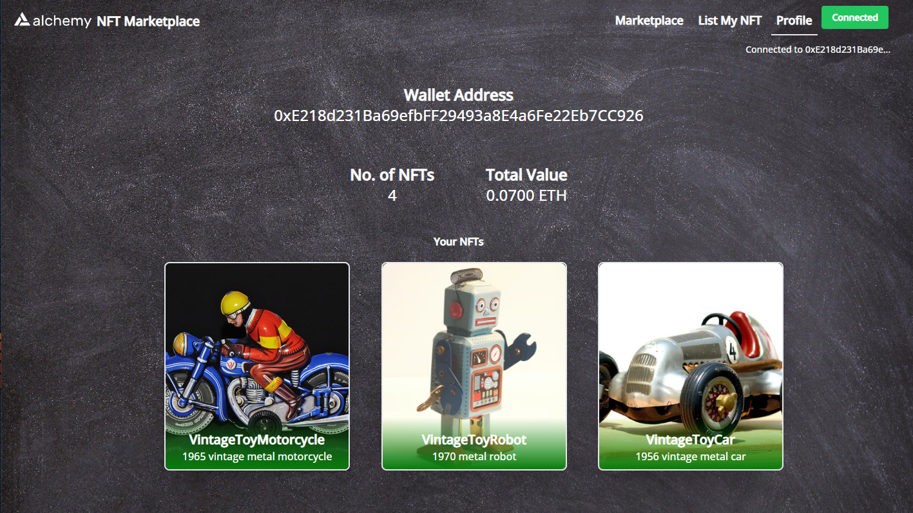

# Basic NFT Marketplace end to end

## This project includes:

* How to create an NFT Marketplace smart contract to list, sell, and buy NFTs
* How to create the front-end of your Marketplace
* Get fees and commissions on NFTs sales





----

Goerli Contract address: 
0x68D175032B2011DCaEBeFf66B2586428F40534C2

----

## Open issues & tweaks:

* ~~// TODO: check if there's a bug in NFT owner (profile page -> You are the owner of this NFT)~~
* // TODO: finish Royalties Fees implementation (contract OK / frontend still pending excecute Fee)
* // TODO: navbar shows "Connected" button when is not connected
* // TODO: Change default metadata and image name when upload to PINATA
* // TODO: implement "Decaying Royalties": this could be time based, ownership based or any other variants as sales reduce the number of times a NFT changes hands

----

## How to use

To set up the repository and run the marketplace locally, run the below
```bash
git clone (github link)
npm install
npm start
```